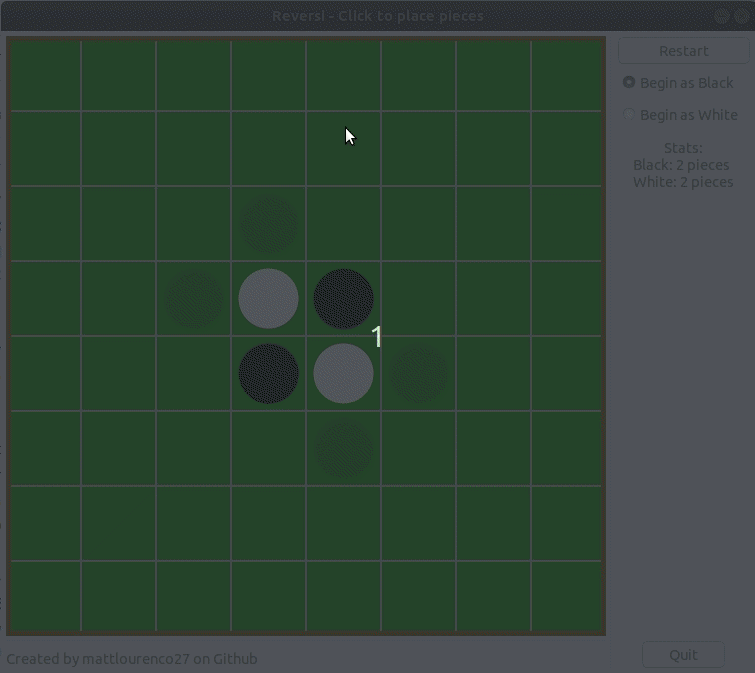

# Reversi AI

I created an AI that looks through possible future states of the game to make a decision.

## Navigation

* [Console Reversi](https://github.com/mattlourenco27/Reversi-AI/tree/console_reversii)
* [Running the program](##Running-The-Program)
* [Compiling if Necessary](##Compiling-if-Necessary)

## Running The Program

To run the Reversi AI travel to the `/exec/` folder in the repository and run `./reversi`.
Unfortunately this only works on unix at the moment.

## Compiling if Necessary

To recompile the program navigate to the home directory of the repository in your console and run the command
``g++ main.cpp ai.cpp board.cpp boardAnalysis.cpp gameLogic.cpp -o ./exec/reversi `pkg-config --cflags --libs gtkmm-3.0` ``.
Ensure that you have properly installed the developer version of gtkmm and pkg-config. Unfortunately this command only works on unix.